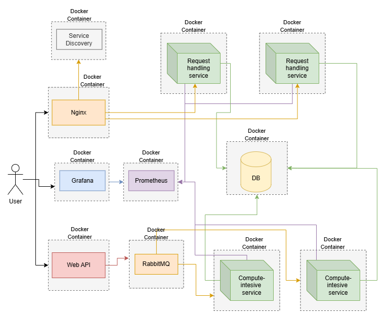

# Sandbox Cloud Network Documentation

The system design for a Cloud Network project using miscroservices architecture.

## Project Architecture

## 🖥️ Tech Stack

- Python
    - Framework
        - FastAPI
    - Library
        - Celery
- Database 
  - PostgreSQL
- Monitoring
  - Prometheus
  - Grafana
  - Cadvisor
  - Node-exporter
- RabbitMQ
- Consul
- nginx

## Development Choices

Here are the choices made during development and my thought process behind them.

### Python

**Postivies:** Python offers code simplicity and versatility which makes a program more readable and maintainable. It also has vast applications and use cases, given that it has an enormous amount of frameworks and libraries. FastAPI is the framework I use, and it is very fast with built-in API documentation features. 

**Drawbacks:** Python offers simplicity only because it is a high level language, which hides a lot of the complexity, in turn making it slower to execute and consume more memory. It is not ideal for database intensive tasks and is more prone to runtime errors.

### PostgreSQL

**Postivies:** PostgreSQL is very fast, reliable and open-source. In addition to that, it is an object-relational database which allows for custom defined data types and includes storage of more complex data.

**Drawbacks:** It is harder to scale horizontally due to the need to maintain ACID properties (Atomicity, Consistency, Isolation, Durability). Requires a predefined schema and concurrent writes are a bit of a struggle. 

### RabbitMQ

**Postivies:** It allows for the decoupling of producers and consumers, and ensures the mesages are delievered reliably and also support message persistence. Can handle a large number of messages and supports multiple message protocols. 

**Drawbacks:** Is pretty complex to configure at first and consumes a lot of resources. Has a steep learning curve, to those new to queues, bindings, and distributed systems. It does not guarantee message order.

### Prometheus

**Postivies:** Has good monitoring, alerting capabilities and is efficient at metric collection. Offers PromQL for refined data and more meaningful results. Support horizontal scaling for managing large volumes of data 

**Drawbacks:** Has basic visulization but requires a library like Grafana to actually do some customizations. There are some challenges when it comes to scaling as it is risky and also requires ongoing maintentance.

### Nginx

**Postivies:** Is pretty lighweight, efficient and can handle high amounts of traffic, while still providing fast performance. Uses few resources and memory and can handle about 10000 concurrent connection without affecting the memory too much. Making it highly scaleble. 

**Drawbacks:** Doesn't have as many modules as Apache, which limits its functionality. Its configuration is a bit more challenging for new users. 

## Deployment

### Containerization
Each microservice is containerized in separate Docker containers. This isolates the system and can run in consistent environments, regardless of the host system, by using Docker Compose to manage multiple instances of a Docker container.

### Scalability
Docker allows to efficiently manage and deploy containers at scale, as the number of containers and their resource requirements increase. It is possible to manually scale services by running multiple instances of a Docker container on the same or different hosts. 

## 🔧 Improvements

- Circuit breaker pattern to handle service failures.

- Nginx Plus to use features like health checks, dynamic reconfiguration and multiple load balancing algorithms.

- Nginx and Service Discovery, via Consul Template to allows for automatic updates to the upstream server based on service registration.

- Database replication to ensure high availability, improve fault tolerance and the performance under heavy loads.

- JWT authorization to allow for secure and statelss authentication between clients and services.

- Monitoring the rest of the services to give full view into the system, improve debugging and system analysis.

- Monitor for bottlenecks and issues to improve the performance bottlenecks that arise and improve long-term scalability.

## Resources

1. Load Balancing with Docker Compose and NGINX. Link: https://medium.com/@aedemirsen/load-balancing-with-docker-compose-and-nginx-b9077696f624

2. What’s the Difference Between RabbitMQ and Redis OSS? Link: https://aws.amazon.com/compare/the-difference-between-rabbitmq-and-redis/ 

3. Getting Started with Celery & RabbitMQ. Link: https://medium.com/geekculture/getting-started-with-celery-243429df53b9

4. High Availability Architecture: Requirements & Best Practices. Link: https://www.couchbase.com/blog/high-availability-architecture/

5. HTTP Load Balancing. Link: https://docs.nginx.com/nginx/admin-guide/load-balancer/http-load-balancer/

6. HTTP Health Checks. Link: https://docs.nginx.com/nginx/admin-guide/load-balancer/http-health-check/

7. Docker Monitoring with Prometheus: A Step-by-Step Guide. Link: https://last9.io/blog/docker-monitoring-with-prometheus-a-step-by-step-guide/

8. HTTP Health Checks. Link: https://docs.nginx.com/nginx/admin-guide/load-balancer/http-health-check/

9. Message Queues with RabbitMq. Link: https://diptochakrabarty.medium.com/message-queues-with-rabbitmq-9c63ca6649b9